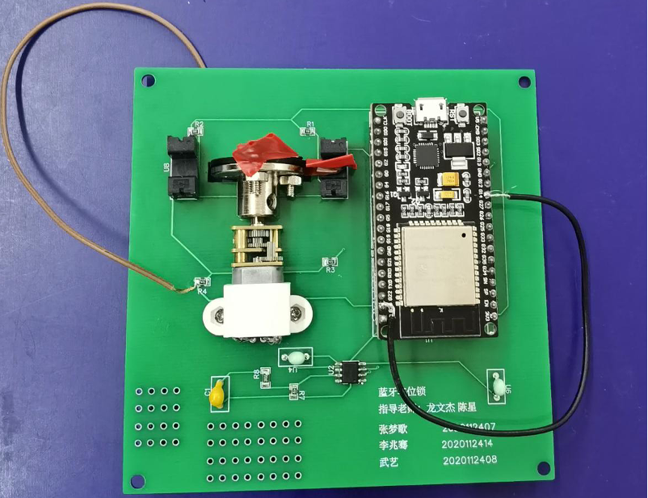

# Intelligent Parking Lock System

## Introduction

This repository contains the implementation of an intelligent parking lock system that operates via Bluetooth communication.

## System Architecture

#### Mobile Endpoint

- A smartphone-based Bluetooth interface initiates control signals.
- Ensures seamless connectivity between the mobile user and the stationary parking lock.

#### Stationary Endpoint

- **Core Controller**: ESP32 microcontroller, orchestrating command processing and delegation.
- **Communication Module**: Classic Bluetooth modules for signal reception.
- **Actuation Module**: TC118SS motor drive module, actuating the motor in response to control signals.
- **Sensory Module**: ITR9606 photoelectric sensors, responsible for status feedback based on lock position.

<figure>
  
  <figcaption>Figure 1: PCB Design</figcaption>
</figure>

<figure>
  
  <figcaption>Figure 2: Final Product</figcaption>
</figure>

### Software Framework

- Developed in C within Mixly and Arduino platforms.
